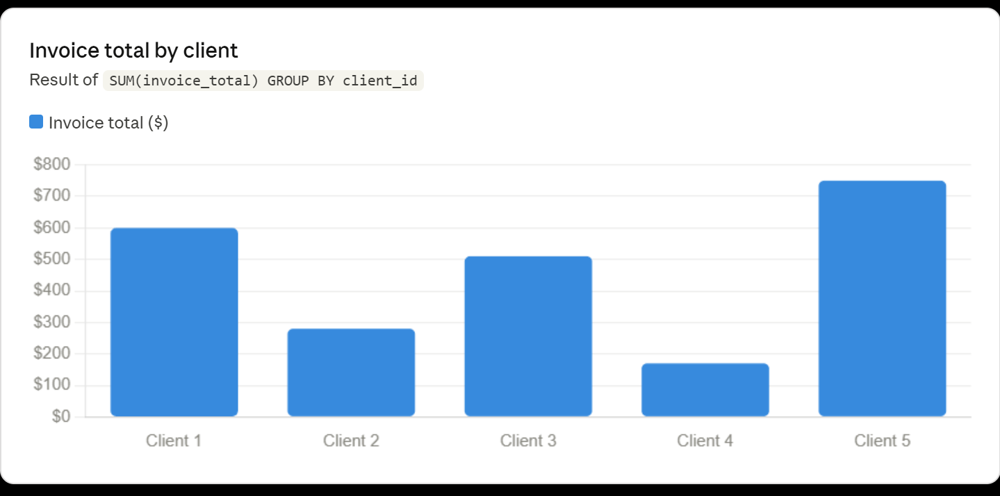
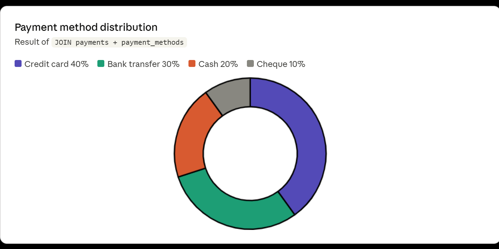
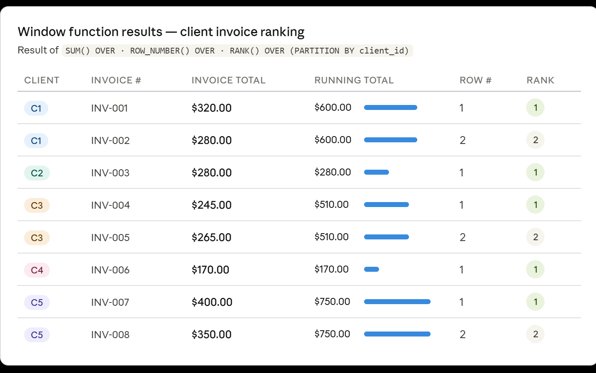

# Retail Business Analysis — MySQL Project

A collection of MySQL queries for analyzing retail business data, covering data retrieval, filtering, joins, aggregations, window functions, and complex multi-table operations.

---

## Database

**Database name:** `DB_for_Mosh`

### Tables referenced
| Table | Description |
|---|---|
| `customers` | Customer profiles including birth date, state, and loyalty points |
| `products` | Product catalog with unit pricing |
| `invoices` | Invoice records with totals, dates, and payment status |
| `clients` | Client details including contact and location info |
| `payments` | Payment transactions linked to clients and payment methods |
| `payment_methods` | Lookup table for payment method names |

---

## Project Structure

```
Retail-Business-SQL-Project/
│
├── Dataset/
│   ├── customers.csv
│   ├── products.csv
│   ├── invoices.csv
│   ├── payments.csv
│   ├── payment_methods.csv
│   ├── clients.csv
│
├── Retail_business_analysis_Data_retrieval_queries.sql   # File 01 — Data retrieval & joins
└── Retail_business_queries_with_multiple_tables.sql      # File 02 — Complex queries & aggregations
│
├── Client Distribution visualization.png                 # Visualization-01
├── Payment method visualization.png                      # Visualization-02
├── Window function visualization.png                     # Visualization-03
│
├── Business Insights and solutions.txt                   # Business insights and solution after data analysis
└── README.md

```
## Technologies Used

```
- MySQL
- SQL
- Relational Database Concepts

```
---

## File 01 — Data Retrieval & Joins

**`Retail_business_analysis_Data_retrieval_queries.sql`**

### Data Retrieval

| Query | Description |
|---|---|
| Unique states | Lists all distinct states from the `customers` table |
| New pricing | Calculates a 10% price increase (`unit_price * 1.1`) for all products |
| Invoices after June 2019 | Filters invoices with `invoice_date > '2019-06-30'` |
| Customers born after 1990 with 1000+ points | Combines `birth_date` and `points` filters |
| Client 5 payments over $20 | Filters `payments` by `client_id` and `amount` |
| Products cheaper than lettuce | Uses a subquery to compare prices against lettuce's unit price |

### SQL Joins

| Query | Description |
|---|---|
| Payment methods | `INNER JOIN` between `payments` and `payment_methods` to resolve method names |
| Clients and their invoices | `JOIN` between `clients` and `invoices` to show order details per client |

---

## File 02 — Complex Queries & Aggregations

**`Retail_business_queries_with_multiple_tables.sql`**

| Query | Description |
|---|---|
| Clients without invoices | Uses `NOT EXISTS` subquery to find clients with no invoice records |
| High-value invoice clients | CTE + `ALL` subquery to find clients whose invoice totals exceed all of client 3's invoices |
| Invoice totals by client | `SUM` + `GROUP BY` to aggregate invoice totals per client |
| Window functions | Uses `SUM() OVER`, `ROW_NUMBER() OVER`, and `RANK() OVER` partitioned by `client_id` |
| Clients with 2+ invoices | `JOIN` + `GROUP BY` + `HAVING count > 2` |
| Invoices paid with method 1 | `JOIN` between `invoices` and `payments` filtered by `payment_method = 1` |

---

## Concepts Covered

- `SELECT`, `WHERE`, `DISTINCT`, `AND` / `OR` filtering
- Subqueries (scalar, correlated, `ALL`, `EXISTS` / `NOT EXISTS`)
- `INNER JOIN`, `JOIN` across multiple tables
- Common Table Expressions (`WITH ... AS`)
- Aggregate functions: `SUM`, `COUNT`, `GROUP BY`, `HAVING`
- Window functions: `SUM() OVER`, `ROW_NUMBER() OVER`, `RANK() OVER`
- Regular expressions: `REGEXP`

---

## | Query | Visualizations | 

- 
- 
- 

---

## Getting Started

1. Open your MySQL client (MySQL Workbench, DBeaver, or CLI).
2. Run the `CREATE DATABASE` and `USE` statements at the top of File 01.
3. Import all .csv files into the MySQL database. Ensure the required tables are populated before running queries.
4. Execute queries from either file in order, or individually as needed.

---

## Requirements

- MySQL 8.0+ (window functions require MySQL 8.0 or later)
